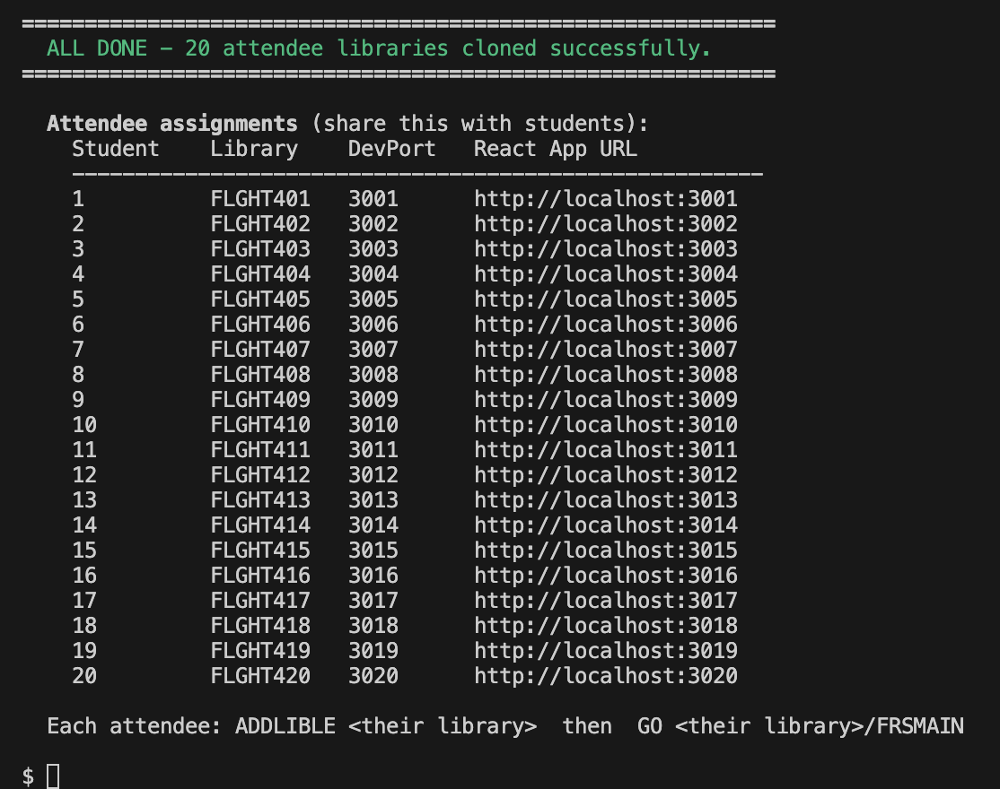

# Instructor Setup Guide

## How to Get an IBM i Virtual Machine (aka LPAR)

To complete this lab, you need access to an IBM i environment. You can provision a free IBM i LPAR through **IBM TechZone**.

1. Go to [https://techzone.ibm.com](https://techzone.ibm.com) and log in with your IBM ID.
2. Search for **"IBM i"** in the catalog, and select an **IBM i 7.6** environment (e.g. *IBM i 7.6 - Sandbox*).  Go to this Collection: https://techzone.ibm.com/collection/techzone-certified-power-vs-base-vms and book your IBM i 7.6 Virtual Machine.

3. Click **Reserve** and fill in the reservation form:
   - **Purpose:** Demo / Self-Education / Test / Pilot
   - **Opportunity information:** misc. information related to your activity.
   - **Geography:** pick the region closest to you (AP, EU, Americas)
4. Submit the reservation. Within a few minutes you'll receive an email with your LPAR's **hostname/IP Address**, **port**, **user profile**, **private key** and **password**.

## IBM i LPAR Setup for FLGHT400 (pick EITHER Option 1 OR Option 2)

### Option 1 — Restore & Clone the FLIGHT400 Application via script (programmatic and faster way)

> **Fast path for multi-user labs.** This replaces the manual "Run `Install-Flight400.sql`, then ask Bob to `CPYLIB` N times" flow (old steps 1.6–1.8). A single script restores the master library **and** creates one isolated copy per attendee (`FLGHT401`, `FLGHT402`, …). Recommended for **20+ participants**.
>
> ℹ️ **You no longer edit `Install-Flight400.sql`.** The IFS path is passed to the script with the `-f` flag instead of hand-editing `v_ifs_path`. The SQL script is kept only as a manual fallback (see the *Manual alternative* note at the end).

#### 1 — Create a new local workspace
- On your laptop, create an empty folder — for example `~/ibmi-lab`.
- In Bob IDE go to **File → Open Folder** and open this new folder.
- Download **`setup_flight400_lab.sh`** into that folder.

#### 2 — Download the save file into your workspace
- From the [Box Folder](https://ibm.box.com/v/flight400-box), download **FLGHT400.FILE** into the folder you just opened.
- This is an IBM i save file — a binary archive that contains the entire FLIGHT400 application (programs, source members, and database files), ready to be restored onto your LPAR.

#### 3 — Connect Bob IDE to your IBM i
- In the Bob IDE Activity Bar, click the **IBM i** icon (plug icon).
- Click **➕ New Connection** and enter the details from your TechZone reservation:
  - **IP/Host:** `<your-lpar-public-ip-address>`
  - **Username:** `<your-user-profile>`
  - **Password / Private Key:** as provided by TechZone (leave Password empty and set the key path if using PowerVS).
- Click **Connect**. 

#### 4 — Deploy the files to the IFS
- In the Bob IDE **Explorer**, right-click **`setup_flight400_lab.sh`** and choose **Deploy Selected Files**. Note the target IFS path shown in the output panel (e.g. `/home/YOURUSER/builds/ibmi-lab`).
- Right-click **`FLGHT400.FILE`** and choose **Deploy Selected Files** to upload it to the same IFS directory.
  ☕ This may take a minute or two — perfect time for a coffee break!

#### 5 — Get the IFS path of the save file
- In the IBM i sidebar, expand **IFS Browser** and navigate to the upload directory from step 1.4.
- Right-click **FLGHT400.FILE** and choose **Copy Path**. It will look like:
  `/home/YOURUSER/builds/ibmi-lab/FLGHT400.FILE`
- Keep this path handy — you'll pass it to the script with `-f` in the next step.

#### 6 — Open a PASE / SSH shell on the IBM i
The script runs **on the IBM i** in a PASE bash shell (it uses the native `system` command). Open a terminal one of these ways:
- In Bob IDE, open a **Terminal → New Terminal**
- Ensure your private key is in your ibmi-lab folder and do `chmod 600 /path/to/ssh_private_key.pem`
- SSH into the LPAR directly: `ssh -i ssh_private_key.pem <myuser>@<myIPaddress>`
- Change into the deploy directory, e.g. `cd /home/YOURUSER/builds/ibmi-lab`.

#### 7 — Preview the setup (dry run — changes nothing)
Always preview first. Replace the path and headcount with your own values (`-n` = number of participants):

```bash
bash setup_flight400_lab.sh \
  -f /home/YOURUSER/builds/ibmi-lab/FLGHT400.FILE \
  -n 20 \
  --dry-run
```

Confirm from the output that:
- The **IFS path** is correct.
- The clone names come out as **FLGHT401 … FLGHT420** (zero-padded, not FLGHT41).
- The **participant count** matches your class size.

#### 8 — Run the setup for real
When the preview looks right, run the **same command with `--dry-run` removed**:

```bash
bash setup_flight400_lab.sh \
  -f /home/YOURUSER/builds/ibmi-lab/FLGHT400.FILE \
  -n 20
```

The script will, in order:
1. Restore the master library **FLGHT400** from the save file (`CRTSAVF` → `CPYFRMSTMF` → `RSTLIB` → `CHGOWN`).
2. Clone it into **FLGHT401 … FLGHT4nn**, one isolated copy per attendee (`CPYLIB`).
3. Print an **attendee assignment table** (Student / Library / Dev Port / React App URL) to share with the class.

✅ The FLIGHT400 application is now restored and cloned for every participant.
✅ **Keep `FLGHT400` as the untouched golden master — do not assign it to a participant.** Attendees start at `FLGHT401`. If someone corrupts their library, you can re-run a clone from the master.
✅ Make sure each attendee has **only their own** `FLGHT4nn` on their library list (not `FLGHT400`).



##### Handy variations
| Goal | Command |
|---|---|
| Master already restored — clone only | `bash setup_flight400_lab.sh --skip-restore -n 30` |
| Restore the master only, no clones | `bash setup_flight400_lab.sh -f <IFS_PATH> --restore-only` |
| Explicit library range (e.g. 401–424) | `bash setup_flight400_lab.sh -f <IFS_PATH> --range 1 24` |
| Overwrite existing libraries | add `--force` |
| See each CL command as it runs | add `-v` |
| Save file has a different SAVLIB name inside | add `--savlib <NAME>` |

### Option 2 — Restore the FLIGHT400 Application via the SQL file (legacy way)

In this section you will deploy the FLIGHT400 save file to your IBM i LPAR and restore the application library. Please skip if Flight400 is already installed and go to the first Exercise.

#### 1 — Create a new local workspace

1. On your laptop, create an empty folder — for example `~/ibmi-lab`.
2. In Bob IDE go to **File → Open Folder** and open this new folder.
   Bob IDE will use this folder as your local workspace.
3. Download [`Install-Flight400.sql`](https://github.com/bmarolleau/flight400-demo/blob/main/Install-Flight400.sql) from this repository into that folder.

#### 2 — Download the save file into your workspace

From the [Box Folder](https://ibm.box.com/v/flight400-box), download **`FLGHT400.FILE`** into the folder you just opened.
This is an IBM i save file — a binary archive that contains the entire FLIGHT400 application (programs, source members, and database files), ready to be restored directly onto your LPAR.

Both files should now be visible in the IBM Bob IDE **Explorer** panel:

| File | Description |
|---|---|
| `FLGHT400.FILE` | IBM i save file containing the FLIGHT400 application |
| `Install-Flight400.sql` | SQL script that restores the application on IBM i |

#### 3 — Connect Bob IDE to your IBM i

1. In the Bob IDE Activity Bar, click the **IBM i** icon (plug icon).
2. Click **➕ New Connection** and enter the details from your TechZone reservation:
   - **IP/Host:** `<your-lpar-public-ip-address>`
   - **Username:** `<your-user-profile>`
   - **Password:** `<your-password>`
   - **Private Key:** If using PowerVS, leave the **Password** field empty, download the private key, and set its path in this field.
3. Click **Connect**. A green status bar message confirms a successful connection.

#### 4 — Deploy the files to the IFS

1. In the Bob IDE **Explorer**, right-click on **`Install-Flight400.sql`**.
2. Choose **Deploy Selected Files**.  
   This uploads the entire workspace to an IFS directory on IBM i. The target IFS path is shown in the output panel — note it (e.g. `/home/YOURUSER/builds/ibmi-lab`). Note: you may get an error in the bottom right of the Bob panel where you have to set the deploy location. Keep the default or change it, then click deploy. 
3. In the Bob IDE **Explorer**, right-click on **`FLGHT400.FILE`**.
4. Choose **Deploy Selected Files**. 
   This uploads the entire workspace to an IFS directory on IBM i. The target IFS path is shown in the output panel — note it (e.g. `/home/YOURUSER/builds/ibmi-lab`).

> ☕ This may take a minute or two, Perfect time for a coffee break! 

The Save File `FLGHT400.FILE` contains the code, programs, database files etc. Everything you need to run the application. 

#### 5 — Verify the upload in the IFS Browser

1. In the IBM i sidebar, expand **IFS Browser**.
2. Navigate to the upload directory noted above (e.g. `/home/YOURUSER/builds/ibmi-lab`).
3. You should see `FLGHT400.FILE` and `Install-Flight400.sql` listed.
4. Right-click on `FLGHT400.FILE` and choose **Copy Path**. It will look something like:  
   `/home/YOURUSER/builds/ibmi-lab/FLGHT400.FILE`

#### 6 — Update the SQL install script

1. Open `Install-Flight400.sql` in the Bob IDE editor.
2. Locate and update these variables at the top of the script:
   - **`v_ifs_path`** — set to the IFS path you just copied (e.g. `/home/YOURUSER/builds/ibmi-lab/FLIGHT400.FILE`)
   - **`v_rst_lib`** — target library name after restore (default: `FLGHT400`; change only if needed)
   - **`v_owner`** — *(optional)* owner profile for the restored library. Leave as `NULL` to use `CURRENT_USER` automatically, or set explicitly (e.g. `DEFAULT 'MYPROFILE'`) to override.

3. Save the file (`Ctrl+S` / `Cmd+S`).

#### 7 — Run the SQL script

1. In the **IFS Browser**, refresh the folder. You should see `Install-Flight400.sql` updated. **Note: If it is not automatically updated, manually edit them in the IFS as you did in 1.6 and save the file.**
2. Right-click `Install-Flight400.sql` → **Run Action** → **Run SQL Statements**.
3. Wait for the script to execute (create save file, restore library, update library ownership).  
   The output console will confirm each step. The final `RSTLIB` command restores the full **FLIGHT400** library including programs, source members, and database files.

#### 8 — Copy the Library if you need a multi-user setup
1. Run CPYLIB FROMLIB(FLGHT400) TOLIB(FLGHT401) (and so on) so each participant gets their own isolated copy.
2. To do this, I asked Bob to run the command: 
   > Run CPYLIB FROMLIB(FLGHT400) TOLIB(FLGHT401) (and so on) so each participant gets their own isolated copy. I have X participants.
3. Bob will create libraries FLGHT401 through FLGHT4nn, each containing a full copy of all objects from FLGHT400. Each participant should then have their assigned library (e.g. FLGHT401) added to their library list.

> **Instructor:** Share this table with students before the lab starts. Each student uses their assigned library and dev port throughout all exercises.

| Student # | Library | Dev Port | React App URL |
|:---------:|---------|:--------:|---------------|
| 1  | FLGHT401 | 3001 | http://localhost:3001 |
| 2  | FLGHT402 | 3002 | http://localhost:3002 |
| 3  | FLGHT403 | 3003 | http://localhost:3003 |
| 4  | FLGHT404 | 3004 | http://localhost:3004 |
| … | … | … | … |
| 50 | FLGHT450 | 3050 | http://localhost:3050 |

> 💡 The **Dev Port** is only needed if you complete **Exercise 1 (Optional Warm-Up)**. When Bob asks you to pin your Vite dev server to a port, use the value from the **Dev Port** column above. Your React app will then be reachable at the **React App URL** shown — provided your SSH tunnel from step 6 is active.

> ✅ **End of Quick Setup.** The FLIGHT400 application is now restored on your IBM i in the `FLGHT4nn` library.

> ✅ Make sure `FLGHT4nn` library is in your library list (in the Code for i settings).

> ✅ If you have a 5250 terminal to your IBM i available, you can add the library to your lib list with `ADDLIBLE FLGHT4nn` if not already done, and launch the application from the CL (Green Screen) command prompt: `GO FLGHT4nn/FRSMAIN`.

> 💡 **Want to explore or troubleshoot the green-screen app?** See the [FLIGHT400 Quick Reference Guide](../FLIGHT400-GUIDE.md) for navigation tips, menu structure, and common operations.

## Exercise-specific Setups

### Exercise 1 — Optional Warm-Up: Generate a React Carbon App from a Green Screen

Before the lab, use Bob to install Node.js 22 once on the IBM i partition used for the workshop:

> /QOpenSys/pkgs/bin/yum install -y nodejs22

Verify installation:

> /QOpenSys/pkgs/lib/nodejs22/bin/node --version
> /QOpenSys/pkgs/lib/nodejs22/bin/node \
   /QOpenSys/pkgs/lib/nodejs22/lib/node_modules/npm/bin/npm-cli.js --version

Expected results:

Node.js: v22.x.x
npm: 10.x.x